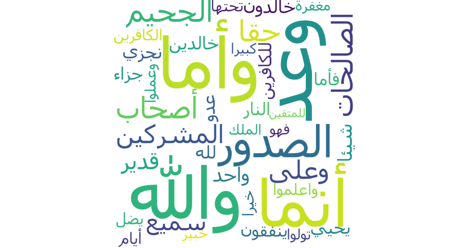

# Documentation

https://aelbuni.medium.com/modeling-topics-in-quran-using-machine-learning-nlp-b88ca23fb44d

# quran-nlp
quran-nlp is an opensource project that aims to provide a boilerplate to help researchers to mine for knowledge from the Quran

# Usage example

```
from quran_nlp.quran_nlp import QuranContextToWords
import matplotlib.pyplot as plt 

# Instantiate a new object
contextToWords = QuranContextToWords()

###################
# Parameter Tuning
###################
# min_count is for pruning the internal dictionary. 
# Words that appear only once or twice in a billion-word corpus are probably uninteresting typos and garbage.
min_count = 20
# The Word2Vec Skip-gram model, for example, 
# takes in pairs (word1, word2) generated by moving a window across text data, 
# and trains a 1-hidden-layer neural network based on the synthetic task of given an input word, 
# giving us a predicted probability distribution of nearby words to the input.
window = 7
# workers , the last of the major parameters (full list here) is for training parallelization, to speed up training:
workers = 8
# learning rate
alpha = 0.22

# Start the learning process and cache the model for use
contextToWords.process_quran_book(min_count, window, workers, alpha)

# Start using the model and play with visualization
# You can generate multiple plots through matlibplot as follows
plt.figure(1)
plt.subplot(211)
word = 'الجنة'
contextToWords.print_similar_word_cloud(word, 20)

plt.subplot(212)
word = 'الله'
contextToWords.print_similar_word_cloud(word, 20)
```
## Result Plot
Plotting two figures, the first for `Heaven`, and the second is `Allah`


